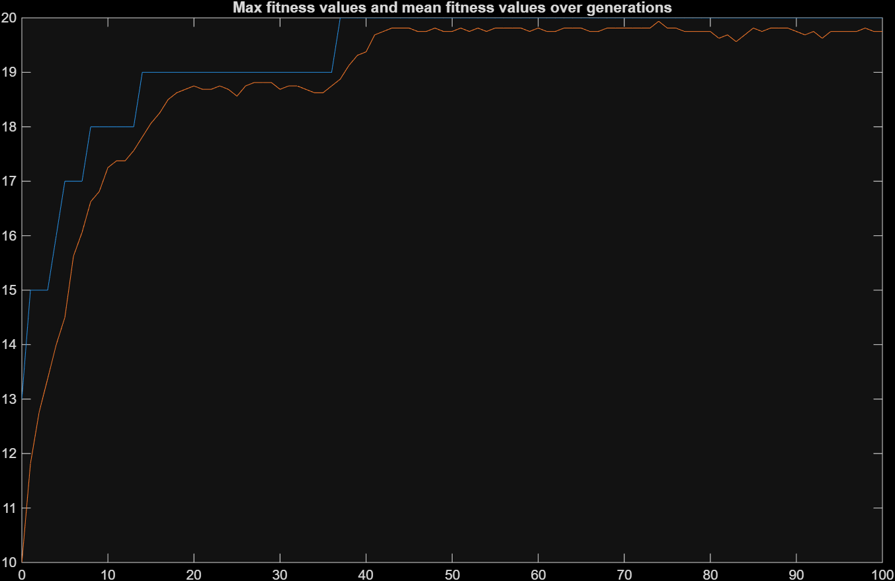

# Genetic algorithm

### Genetic algorithm written in Matlab.

Implemented selection methods:
- proportional selection / spinning wheel selection
- tournament selection

Implemented crossover methods:
- uniform crossover
- one-point crossover

Chart presenting change of maximum fitness function value and average fitness function value in each generation. 
Fitness function: sum of bits in genome. 
Population: 16 
Genotype length: 20 
Probability of mutation: 0.01 
Probability of crossing: 0.7 
Number of generations: 100 

